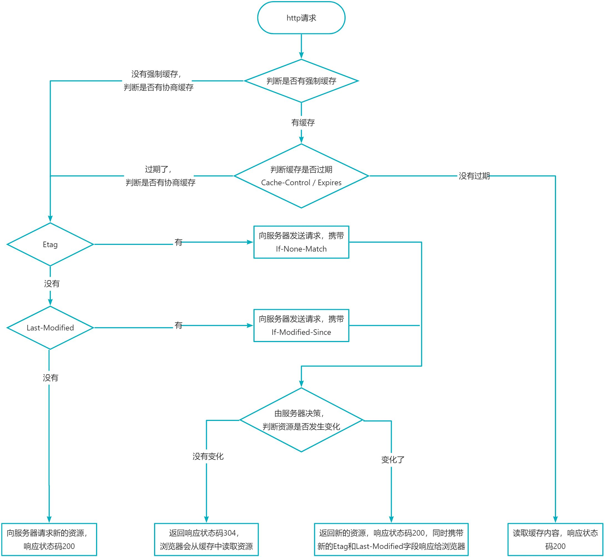

## 浏览器缓存机制：强制缓存和协商缓存

是什么：浏览器缓存是浏览器对请求过的文件进行缓存，以便下一次访问时重复使用

好处：提高访问速度，降低请求次数，可以减轻服务器压力

分类：浏览器缓存分为强制缓存和协商缓存。

### 强制缓存

浏览器不会向服务器发送请求，而是会直接从本地缓存中读取文件并返回响应状态码 200。

* `200 OK (form memory cache)`：缓存来自内存
* `200 OK (form disk cache)`：缓存来自硬盘

强制缓存是由服务器设置的，当服务器返回资源时，会携带特定的响应头字段： `Expires` 、 `Cache-Control` 。如果在缓存有效期内，下次请求该资源就会命中强制缓存，不会向服务器发送请求了。

* `Expires`：Http 协议 1.0 的强制缓存方案。
* `Cache-Control`：Http 协议 1.1 的强制缓存方案（现在都用的 1.1）。

如果这两个字段同时设置， `Cache-Control` 生效，它的权重更高。

**字段详情**

1. Expires（超时时间）

    它的值就是一个 GMT 格式的时间戳，比如： `Expires: Tue, 08 Mar 2033 01:20:16 GMT; `

2. Cache-Control（控制强制缓存）

    * max-age：用来设置资源缓存时间，单位为秒；
    * no-store：禁止一切缓存（这个才是响应不被缓存的意思）。

    * no-cache：强制客户端直接向服务器发送请求, 也就是说每次请求都必须向服务器发送。服务器接收到请求，然后判断资源是否变更，是则返回新内容，否则返回 304，未变更。

### 协商缓存

浏览器必须向服务器发送请求，由服务器判断该资源是否变化，从而决定是否走缓存。

* 如果返回响应状态码 304，走缓存
* 如果返回响应状态码 200，不走缓存

::: tip
304 Not Modified 说明无需再次传输请求的内容，也就是说可以使用缓存的内容。
:::

协商缓存由：位于响应头的：**Etag / Last-Modified** 和位于请求头的 **If-None-Match / If-Modified-Since** 来决定。

大体流程如下：

1. 浏览器向服务器第一次请求资源，服务器返回该资源，响应状态码 200，在响应头设置 Etag 和 Last-Modified；
2. 浏览器接受到资源时，会保存 Etag 和 Last-Modified 字段；
3. 当浏览器刷新或重新请求资源时，会在请求头携带 If-None-Match（它的值就是之前保存的 Etag） 和 If-Modified-Since（它的值就是之前保存的 Last-Modified）两个字段发送给服务器:
   - 服务器会判断  If-None-Match 和 If-Modified-Since 与服务器保存的 Etag 和 Last-Modified 字段是否一致（判断是否是相同的文件）；
     - 如果一致，服务器返回响应状态码 304，浏览器接受到 304 状态码，就会自动去缓存中读取该资源；
     - 如果不一致，服务器返回新的资源并携带新的 Etag 和 Last-Modified 字段给浏览器，此时响应状态码为 200。

**字段详情**

Etag

- 通常由文件的索引节（INode），大小（Size）和最后修改时间（MTime）进行 Hash（算法，生成一个值，这个值等同于存放数据的地址） 后得到的。相同文件生成的 Etag 相同，不同文件生成的 Etag 不同；

Last-Modified

- 文件最近一次的修改时间

## 总流程

先看有没有强缓

- 没有强缓，看有没有协缓

- 有强缓，看强缓有没有过期
  - 没过期，直接读强缓，返回缓存文件，响应状态码 200
  - 过期，看有没有协缓
    - 看有没有Etag（接没有强缓）
      - 有，发请求，携带If-None-Match
      - 没有
        - 看有没有Last-Modified
          - 有，发请求，携带If-Modified-Since
            - 由服务器决策，判断资源是否发生变化（接有Etag）
              - 没有变化，返回响应状态码 304，去缓存中读取该资源
              - 变化了，响应状态码为 200，服务器返回新的资源并携带新的 Etag 和 Last-Modified 字段给浏览器
          - 没有
            - 向服务器发送新请求，服务器返回新的资源，响应状态码 200

